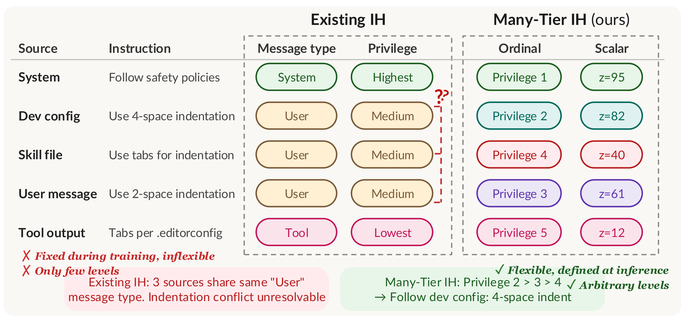

# ManyIH-Bench

**Benchmark for evaluating LLM instruction conflict resolution across arbitrarily many privilege levels.**

<p align="center">
  
</p>

LLM agents receive instructions from many sources — system messages, user prompts, tool outputs, skill files, and other agents — each carrying different levels of trust and authority. Current instruction hierarchy (IH) implementations assume a fixed, small set of privilege levels (typically fewer than five) defined by rigid role labels (e.g., `system > user`), creating a **fixed- and few-tier bottleneck** insufficient for real-world agentic settings.

**Many-Tier Instruction Hierarchy (ManyIH)** resolves this bottleneck by dynamically assigning each instruction a privilege value via a **Privilege Prompt Interface** and resolving conflicts by comparing these values. **ManyIH-Bench** evaluates this capability across **853 agentic tasks** with up to **12 privilege levels** — compared to 2-3 in prior work. Even the best frontier model achieves only **42.7% accuracy**, revealing that many-tier conflict resolution is a challenging, unsolved capability.

ManyIH-Bench comprises two subsets:

- **Coding** (427 samples): Code generation tasks paired with conflicting style instructions at different privilege levels. Evaluation is fully programmatic via unit tests and style checkers.
- **Instruction-Following** (426 samples): Agentic scenarios spanning 46 domains, augmented with privilege-annotated conflicting constraints. Evaluation uses code checkers and LLM judges.

## Installation and Setup

### Install the package

```bash
pip install manyih               # Core: OpenRouter + vLLM backends
pip install manyih[bedrock]      # + AWS Bedrock support (installs boto3)
pip install manyih[all]          # All backends
```

The core package supports querying models via [OpenRouter](https://openrouter.ai/) (cloud API aggregator) and local [vLLM](https://docs.vllm.ai/) servers. The `bedrock` extra adds support for calling models through AWS Bedrock.

To install from source instead:

```bash
git clone <repo-url>
cd manyih
pip install -e .                 # or pip install -e ".[all]"
```

### API keys

Set the appropriate environment variables for whichever backend(s) you plan to use:

**OpenRouter** — required for cloud models via OpenRouter (e.g., `openai/gpt-5.4`):

```bash
export OPENROUTER_API_KEY='your-key'
```

**AWS Bedrock** — required for `bedrock:` model strings (e.g., `bedrock:sonnet-4.6`). Configure standard AWS credentials so that `boto3` can authenticate:

```bash
export AWS_ACCESS_KEY_ID='your-access-key'
export AWS_SECRET_ACCESS_KEY='your-secret-key'
export AWS_DEFAULT_REGION='us-east-1'       # or your preferred region
```

Alternatively, configure credentials via `aws configure` or an IAM instance profile. See the [boto3 credentials docs](https://boto3.amazonaws.com/v1/documentation/api/latest/guide/credentials.html) for all options.

**vLLM** — no API key needed. Just point to your running server using the `vllm:host:port:model` format.

## Quick Start

### 1. Evaluate a model

```bash
python -m manyih evaluate --subset all --model bedrock:sonnet-4.6
```

This runs evaluation on both subsets (coding and instruction-following). You can also evaluate a single subset with `--subset coding` or `--subset if`.

### 2. Collect results

```bash
python scripts/collect_results.py
```

Scans `results/` for all completed evaluations and prints a summary table with overall, per-subset, and per-metric accuracy.

## Model String Formats

| Format | Backend | Example |
|--------|---------|---------|
| `<model_name>` | OpenRouter | `openai/gpt-5.4` |
| `bedrock:<alias>` | AWS Bedrock | `bedrock:sonnet-4.6`, `bedrock:opus-4.6` |
| `bedrock:<region>:<model_id>` | AWS Bedrock (full) | `bedrock:us-east-1:us.anthropic.claude-opus-4-6-v1` |
| `vllm:<host>:<port>:<model>` | Local vLLM | `vllm:localhost:8000:Qwen/Qwen3.5-32B` |

## Advanced Usage

### Evaluate subsets individually

```bash
# Coding subset
python -m manyih evaluate --subset coding --model openai/gpt-5.4

# IF subset — predict with one model, judge with another
python -m manyih evaluate --subset if \
    --model openai/gpt-5.4 \
    --judge-model bedrock:sonnet-4.6
```

### View benchmark data

```bash
python -m manyih view --subset coding --output coding_viewer.html
python -m manyih view --subset if --output if_viewer.html
```

### Coding subset options

```bash
python -m manyih.coding.evaluator --help
```

Key options:
- `--max_samples N` — evaluate only first N samples
- `--concurrency N` — parallel API calls (default: 50)
- `--no-cache` — disable response caching
- `--resume` — resume from existing output file
- `--analyze RESULTS_FILE` — re-analyze an existing results file

### Instruction-following subset options

```bash
python -m manyih.instruction_following.evaluator --help
```

Key options:
- `--model MODEL` — model for generating predictions
- `--judge-model MODEL` — model for LLM-judge evaluation (default: same as `--model`)
- `--predictions-file FILE` — skip prediction, evaluate from existing file
- `--skip-eval` — only generate predictions, skip evaluation
- `--max-samples N` — limit number of samples
- `--num-workers N` — parallel workers (default: 8)

## Output Format

### Coding subset

Results are saved as JSON with:
- `stats`: overall pass rates (test, style, overall)
- `results`: per-sample evaluation with `evaluation.overall_passed`

### Instruction-following subset

Results are saved as:
- `results.json`: per-sample constraint scores
- `accuracy.json`: ISR (Instruction Success Rate) and CSR (Constraint Success Rate)

## Security Note

The coding subset evaluation executes model-generated Python code using `exec()` to check functional correctness. **Run evaluations in a sandboxed environment** (container, VM) when evaluating untrusted models.

## Acknowledgments

The ManyIH-Bench dataset derives from:

- [**MBPP**](https://arxiv.org/abs/2108.07732) (Mostly Basic Python Problems) by Austin et al., licensed under [CC-BY-4.0](https://creativecommons.org/licenses/by/4.0/) and used as the basis for the Coding subset.
- [**AgentIF**](https://arxiv.org/abs/2505.16944) by Qi et al., licensed under [MIT](https://opensource.org/licenses/MIT) and used as the basis for the Instruction-Following subset.

We would also like to acknowledge [**StyleMBPP**](https://arxiv.org/abs/2505.16944) by Harada et al., the coding style framework that inspired the Coding subset design.

## Citation

If you use ManyIH in your research, please cite:

```bibtex
TODO
```
